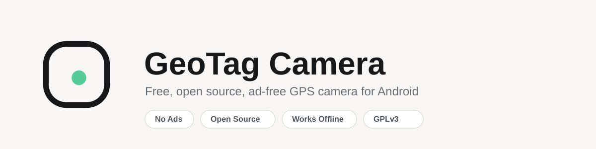

<picture>
  <source media="(prefers-color-scheme: dark)" srcset="assets/banner-dark.svg">
  <source media="(prefers-color-scheme: light)" srcset="assets/banner-light.svg">
  
</picture>

# GeoTag Camera

Free, open source, ad free Android camera app that stamps every photo with GPS location, address and timestamp. Built for field surveyors, college students and NGO teams who need to prove where and when a photo was taken, without paying for it or handing over their data.

[](LICENSE)
[](https://developer.android.com)
[](https://github.com/konkomaji/geotagcamera/actions/workflows/android-ci.yml)
[](#roadmap)

Website: https://konkomaji.github.io/geotagcamera/

## Why this exists

Most geotagging camera apps on the Play Store make you sit through ads before you can even open the camera, lock basic stamp fields behind a subscription, ask for permissions that have nothing to do with taking a photo, and stop working the moment you lose signal. GeoTag Camera fixes that, in the open, so anyone can read the code and check it for themselves.

## Features

**Capture**
- Clean camera capture built on CameraX, nothing running in the background that shouldn't be
- GPS coordinates, address and timestamp stamped directly onto the photo
- GPS data also written into the photo's own EXIF metadata, so GIS and photo tools pick it up automatically
- Every capture is published straight to your phone's Photos/Gallery app (Pictures/GeoTagCamera), nothing leaves your phone unless you choose to share it

**Built to actually work in the field**
- Offline first reverse geocoding, addresses are cached on-device so the stamp keeps working with no signal
- Every capture fetches a fresh location instead of reusing a stale cached one
- Only camera and location are requested on Android 10+; Android 9 and older also needs storage access to save into the gallery, nothing else, ever

**Made for your organization**
- Choose exactly which fields show on the stamp: coordinates, address, timestamp, altitude, accuracy, compass bearing
- Add your college, company or project name to the stamp, free, no paywall

**Trust and verification**
- Every photo is SHA-256 hashed and signed on-device using a key generated in the Android Keystore, so you can later prove it hasn't been edited since capture
- Field workers can add a signature directly onto the photo before saving, useful for inspection reports and muster-roll style documentation

**No ads, no tracking, ever**
- No ad SDKs, no analytics SDKs, no hidden network calls
- No account, no cloud sync, no server collecting anything, because there is no server

## Tech stack

- Kotlin, Jetpack Compose
- CameraX for capture
- Fused Location Provider for GPS
- Android's built-in Geocoder for reverse geocoding (no third party API key)
- Room for local storage
- Android Keystore for on-device photo signing
- Material 3

## Project status

GeoTag Camera is actively being built. Version 1 targets photo capture with everything listed under Features above. Video geotagging and the rest of the roadmap below come after.

## Roadmap

- Video geotagging
- Project and site folders to organize captures
- Batch export to PDF report
- CSV, KML and GeoJSON export for GIS workflows
- Voice notes attached to photos
- Before and after photo pairing
- Multiple stamp templates
- Quick capture home screen widget
- Biometric app lock
- Manual local backup and restore
- Hindi and regional language support
- Material You dynamic theming

## Building from source

```
git clone https://github.com/konkomaji/geotagcamera.git
cd geotagcamera
```

Open the project in Android Studio (Koala or newer) and let it sync, or build from the command line:

```
./gradlew assembleDebug
```

Minimum SDK is 26 (Android 8.0), target SDK is 34.

## Permissions

| Permission | Why it's needed |
|---|---|
| Camera | To take the photo |
| Location (fine and coarse) | To read GPS coordinates for the stamp and EXIF data |
| Storage (Android 9 / API 28 and below only) | To save the finished photo into the gallery — Android 10+ does this without any storage permission |

That's the complete list. No broad storage access on modern Android, no contacts, no network state beyond what the OS grants by default, no background location.

## Contributing

Issues and pull requests are welcome. If you're planning a larger change, open an issue first so we can talk through the approach before you put the work in.

## License

GeoTag Camera is licensed under the [GNU General Public License v3.0](LICENSE). You're free to use, study, modify and redistribute it under the same terms.

## Author

Built by [Konko Maji](https://github.com/konkomaji).
